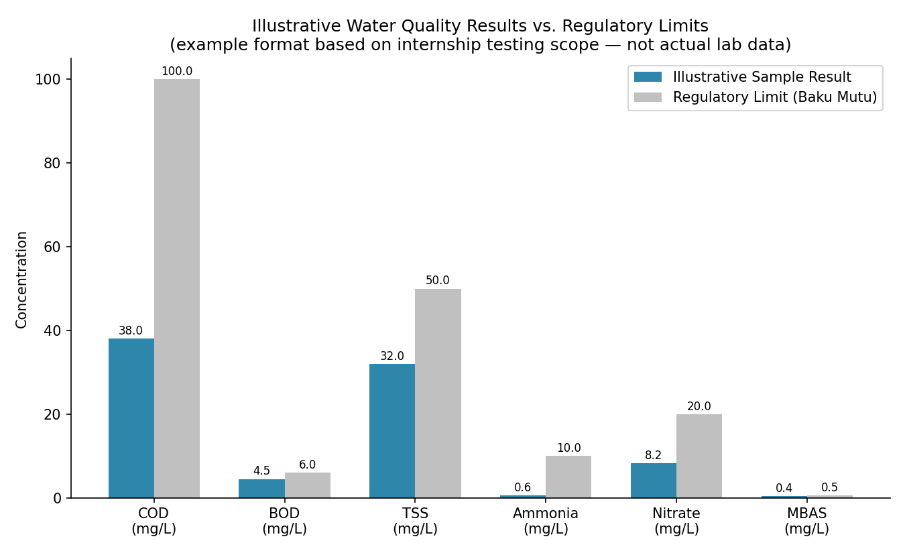

# Water Quality Analysis Internship — Environmental Laboratory, DLHK Bangka Belitung

## Overview

This project documents hands-on laboratory work analyzing clean water, wastewater, seawater, and surface water samples against Indonesian National Standards (SNI) and international methods (JIS). The internship combined instrumental analysis, microbiological testing, and standard operating procedure (SOP) compliance in a government environmental monitoring lab.

- **Host institution:** UPTD Laboratorium Lingkungan, Dinas Lingkungan Hidup dan Kehutanan (DLHK), Provinsi Kepulauan Bangka Belitung
- **Program:** Kuliah Luar Kampus (KLK) / Merdeka Belajar Kampus Merdeka (MBKM), Universitas Bangka Belitung
- **Duration:** 28 July – 14 November 2024 (16 weeks)
- **Role:** Laboratory Analyst Intern (Biology)
- **Location:** Pangkalpinang, Bangka Belitung Islands, Indonesia

## Objectives

- Understand laboratory organizational structure, quality policy, and SOPs for environmental sample handling
- Perform physical, chemical, and biological analyses of water samples in line with SNI/JIS standards
- Gain applied experience operating analytical instrumentation (UV-Vis, AAS, Hach spectrophotometry)
- Connect water quality data to real environmental issues affecting local communities and ecosystems

## Instruments Used

| Instrument | Application |
|---|---|
| UV-Vis Spectrophotometer (Shimadzu 2600) | Nitrite, nitrate, total phosphate, COD, sulfate, ammonia, MBAS, total nitrogen |
| Atomic Absorption Spectrophotometer (AAS) | Dissolved/total metals: Zn, Pb, Cu, Fe, Mn, As, Cd |
| Hach Spectrophotometer (DR 1900) | Sulfide, sulfate, chloride, free chlorine, cyanide, nitrate, turbidity, color, hardness, TSS |

## Parameters Tested

**Biological:** Total Coliform & Fecal Coliform (MPN method)

**Chemical:** COD, BOD, Nitrite, Nitrate, Total Nitrogen, Sulfate, Ammonia, Cyanide, Total Phosphate, Chloride, MBAS (anionic surfactants), dissolved/total metals

**Physical:** pH, temperature, salinity, electrical conductivity (EC), TSS

All methods followed applicable SNI standards (e.g., SNI 6989 series) or the lab's internal instruction sheets (Instruksi Kerja), with full method references listed in the original report.

## Results vs. Regulatory Limits (Illustrative)

*Note: values shown above are illustrative, formatted to demonstrate how tested parameters are typically evaluated against Indonesian regulatory limits (baku mutu), not actual reported lab results (which are confidential to the client/agency).*

Reading a result like this is the real skill an environmental analyst brings: a COD of 38 mg/L against a 100 mg/L limit isn't just "a number under the line" — it tells you the water is within safe range but still tracking meaningfully above natural background levels, worth flagging for trend monitoring rather than immediate remediation.

## Skills Demonstrated

- Sample preparation, preservation, and digestion techniques
- Spectrophotometric analysis and Beer-Lambert law–based concentration calculations
- Titrimetric methods (argentometric/Mohr method for chloride, Winkler method for BOD)
- Microbiological culture technique (MPN method) with aseptic handling
- Laboratory safety (K3/PPE) and hazardous waste (B3) handling
- Data recording, logbook documentation, and technical reporting

## Repository Contents

- `Laporan_Akhir_Magang_Muhammad_Putra_Jundaris.pdf` — Full internship report (Indonesian)
- `method-notes.md` — Technical mini-explainers for COD, BOD, and Coliform MPN testing, covering reaction chemistry and interpretation
- `results_comparison.png` — Illustrative chart comparing tested parameters to regulatory limits
- `/documentation` — Field and lab activity photos:
  - **Coliform testing** — MPN presumptive-test setup, inoculating Lauryl Sulfate Broth tubes for fecal contamination screening
  - **Metal analysis** — Sample preparation for Atomic Absorption Spectrophotometry (AAS), measuring dissolved/total metals (Zn, Pb, Cu, Fe, Mn, As)
  - **Cyanide testing** — Distillation and Hach spectrophotometric analysis (λ = 578 nm) to isolate and quantify CN⁻
  - **MBAS testing** — Chloroform extraction of the methylene blue–surfactant complex, measured at λ = 652 nm to detect detergent contamination
  - **Nitrite testing** — Azo dye formation via diazotization, measured at λ = 543 nm
  - **B3 (hazardous waste) handling** — Segregation and labeling of laboratory hazardous waste per safety protocol
  - **Team briefing / logbook documentation** — Daily activity logging and coordination with lab supervisors

## From Water Chemistry to Spatial Analysis

This internship's core skill — reading a lab value against a regulatory threshold — connects directly to the spatial ecology work at the center of my portfolio. Each water sample in this internship was tied to a specific sampling point; if geotagged, parameters like nitrate, ammonia, and TSS could be mapped in QGIS the same way I mapped *Holothuria atra* density across Punggur Tuing Coast in my undergraduate thesis. Point-source water quality data plotted spatially — rather than read as isolated lab numbers — is what turns a compliance test into a pollution-gradient map, which is the direction I want to take this dataset if I revisit it as a spatial analysis exercise.

## Key Takeaway

Government environmental laboratories serve as a critical link between raw water quality data and environmental policy decisions — parameters like nitrate, phosphate, and ammonia directly indicate nutrient pollution and eutrophication risk relevant to Bangka Belitung's coastal and inland waters, connecting directly to the ecological themes explored in my undergraduate thesis on *Holothuria atra* spatial distribution.

## Author

**Muhammad Putra Jundaris**
Biology Graduate, Universitas Bangka Belitung
[LinkedIn](#) · [GitHub Portfolio](https://github.com/putrajundaris/environmental-gis-data-portfolio)
